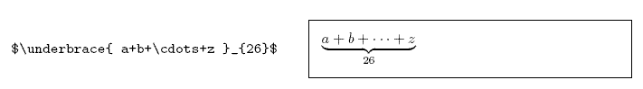

[开始在 GitHub 上编写和格式化 - GitHub Docs](https://docs.github.com/cn/get-started/writing-on-github/getting-started-with-writing-and-formatting-on-github)

[使用高级格式 - GitHub Docs](https://docs.github.com/cn/get-started/writing-on-github/working-with-advanced-formatting)

~~github-markdown不支持目录~~

[TOC]

# Markdown

## 基础

### 分级标题

```
# 一级标题
## 二级标题
### 三级标题
#### 四级标题
##### 五级标题
###### 六级标题
Markdown没有七级标题
```


### 任务

```
- [ ] 任务一 未做任务 `- + 空格 + [ ]`
- [x] 任务二 已做任务 `- + 空格 + [x]`
```

- [ ] 未做任务

- [x] 已做任务


### 字体

```
*斜体*或_斜体_
**粗体**
***加粗斜体***
~~删除线~~
~字体~
<u>下划线</u>
==背景高亮==
```

*斜体*或_斜体_

**粗体**

***加粗斜体***

~~删除线~~

~字体~

<u>下划线</u>

==背景高亮==


代码：

```xml
<font face="黑体">我是黑体字</font>
<font face="微软雅黑">我是微软雅黑</font>
<font face="STCAIYUN">我是华文彩云</font>
<font color=#0099ff size=12 face="黑体">黑体</font>
<font color=gray size=5>gray</font>
<font color=#00ffff size=3>null</font>
```

显示效果：

<font face="黑体">我是黑体字</font>

<font face="微软雅黑">我是微软雅黑</font>

<font face="STCAIYUN">我是华文彩云</font>

<font color=#0099ff size=12 face="黑体">黑体</font>

<font color=gray size=5>gray</font>

<font color=#00ffff size=3>null</font>


背景色

```
<table><tr><td bgcolor=orange>背景色是：orange</td></tr></table>
```


<table><tr><td bgcolor=orange>背景色是：orange</td></tr></table>


### 转义

```
\
转义
\\ 反斜杠
\` 反引号
\* 星号
\_ 下划线
\{\} 大括号
\[\] 中括号
\(\) 小括号
\# 井号
\+ 加号
\- 减号
\. 英文句号
\! 感叹号
```

\# 不是标题


### 换行

使用两个以上的空格加上回车来实现换行


### 对齐

```
<center>github-markdown已废弃</center>
<center>行中心对齐</center>
<div style="text-align: center;">行中心对齐</div>
<p align="left">行左对齐</p>
<div style="text-align: left;">行左对齐</div>
<p align="right">行右对齐</p>
<div style="text-align: right;">行右对齐</div>
```

<center>行中心对齐</center>

<div style="text-align: center;">行中心对齐</div>

<p align="left">行左对齐</p>

<div style="text-align: left;">行左对齐</div>

<p  align="right">行右对齐</p>

<div style="text-align: right;">行右对齐</div>


### 超链接

#### 行内式

语法说明：

[]里写链接文字，()里写链接地址, ()中的""中可以为链接指定title属性，title属性可加可不加。title属性的效果是鼠标悬停在链接上会出现指定的 title文字，链接地址与title前有一个空格。

代码：

```bash
欢迎阅读 [开始在 GitHub 上编写和格式化 - GitHub Docs](https://docs.github.com/cn/get-started/writing-on-github/getting-started-with-writing-and-formatting-on-github "择势勤")
```

显示效果：

欢迎阅读 [开始在 GitHub 上编写和格式化 - GitHub Docs](https://docs.github.com/cn/get-started/writing-on-github/getting-started-with-writing-and-formatting-on-github "开始在 GitHub 上编写和格式化 - GitHub Docs")


#### 参考式

参考式超链接一般用在学术论文上面，或者另一种情况，如果某一个链接在文章中多处使用，那么使用引用 的方式创建链接将非常好，它可以让你对链接进行统一的管理。

语法说明：
参考式链接分为两部分，文中的写法 `[链接文字][链接标记]`，在文本的任意位置添加[链接标记]:链接地址。

如果链接文字本身可以做为链接标记，你也可以写成`[链接文字][]`
[链接文字]：链接地址的形式，见代码的最后一行。

代码：

```ruby
我经常去的几个网站[Google][1]、[Baidu][2]。

[1]:http://www.google.com 
[2]:http://www.baidu.com
```

显示效果：

我经常去的几个网站[Google][1],[Baidu][2]。

[1]:http://www.google.com
[2]:http://www.baidu.com

#### 脚注

语法说明：

在需要添加注脚的文字后加上脚注名字[^脚注名字],称为加注。 然后在文本的任意位置(一般在最后)添加脚注，脚注前必须有对应的脚注名字。

注意：经测试脚注与脚注之间必须空一行，不然会失效。成功后会发现，即使你没有把脚注写在文末，经Markdown转换后，也会自动归类到文章的最后。

代码：

~~github-markdown不支持脚注~~

```css
使用 Markdown[^1]可以效率的书写文档, 直接转换成 HTML[^2]。

[^1]:Markdown是一种纯文本标记语言

[^2]:HyperText Markup Language 超文本标记语言
```

显示效果：

使用 Markdown[^1]可以效率的书写文档, 直接转换成 HTML[^2]。

注：脚注自动被搬运到最后面，请到文章末尾查看，脚注后方的链接可以直接跳转回到加注的地方。


#### 锚点(页内超链接)

网页中，锚点其实就是页内超链接，也就是链接本文档内部的某些元素，实现当前页面中的跳转。比如我这里写下一个锚点，点击回到目录，就能跳转到目录。 在目录中点击这一节，就能跳过来。还有下一节的注脚。这些根本上都是用锚点来实现的，~~只支持在标题后插入锚点，其它地方无效~~。

代码：

```bash
[任意文字](#标题名称)
[任意文字](#锚点)
锚点 = <a name="第二个跳转"> </a>
注意<a> </a>中间的空格,否则锚点不会自动隐藏
```

显示效果：

跳转到[Markdown](#Markdown)标题

第二个跳转<a name="第二个跳转"> </a>

[第二个跳转](#第二个跳转)

#### 自动链接

语法说明：
Markdown 支持以比较简短的自动链接形式来处理网址和电子邮件信箱，只要是用<>包起来， Markdown 就会自动把它转成链接。一般网址的链接文字就和链接地址一样，例如：

代码：

```dart
&lt;http://example.com/&gt; &emsp;&emsp; 
&lt;address@example.com&gt;
```

显示效果：

<http://example.com/>

<address@example.com>


### 插入图片

```

图片地址可以是绝对路径或者相对路径或者URL
```


#### 本地图片

```

```


#### 网络图片

```

```


### 列表

#### 无序列表

- 使用 *，+，- 表示无序列表。
    代码：

```undefined
* 无序列表项 一
+ 无序列表项 二
- 无序列表项 三
```

显示效果：

* 无序列表项 一

+ 无序列表项 二

- 无序列表项 三


#### 有序列表

有序列表则使用数字接着一个英文句点。
代码：

```undefined
1. 有序列表项 一
2. 有序列表项 二
3. 有序列表项 三
```

显示效果：

1. 有序列表项 一
2. 有序列表项 二
3. 有序列表项 三


### 多级引用

语法说明：

引用需要在被引用的文本前加上>符号和空格，允许多层嵌套，也允许你偷懒只在整个段落的第一行最前面加上 > 。

代码：

```ruby
> 请问 Markdwon 怎么用？ - 小白
>> 自己看教程！ - 愤青
>>> 教程在哪？ - 小白
```

显示效果：

> 请问 Markdwon 怎么用？ - 小白
> > 自己看教程！ - 愤青
> > > 教程在哪？ - 小白
> >
> > ?
>
> ?


### 表格

语法说明：

不管是哪种方式，第一行为表头，第二行分隔表头和主体部分，第三行开始每一行为一个表格行。
列于列之间用管道符|隔开。原生方式的表格每一行的两边也要有管道符。
第二行还可以为不同的列指定对齐方向。默认为左对齐，在-右边加上:就右对齐。
`-` 左对齐， `:-:` 中心对齐，`-:` 右对齐

表格代码：

```ruby
|学号|姓名|序号|
|-|-|-|
|小明明|男|5|
|小红|女|79|
|小陆|男|192|
```

原生方式写表格：


| 学号   | 姓名 | 序号 |
| ------ | :--: | ---: |
| 小明明 |  男  |    5 |
| 小红   |  女  |   79 |
| 小陆   |  男  |  192 |


### 内容目录

在段落中填写 [TOC] 以显示全文内容的目录结构。

```json
[TOC]
```

效果参见最上方的目录。


### 代码块

#### 行内式

代码：

```cpp
C语言里的函数 `scanf()` 怎么使用？
```

显示效果：

C语言里的函数 `scanf()` 怎么使用？


#### 多行代码块

代码：

```cpp
、、、
include <stdio.h>
int main(void)
{
printf("Hello world\n");
}
、、、
```

**显示效果：**

```cpp
include <stdio.h>
int main(void)
{
printf("Hello world\n");
}
```


### HTML原始码

在代码区块里面， & 、 < 和 > 会自动转成 HTML 实体，这样的方式让你非常容易使用 Markdown 插入范例用的 HTML 原始码，只需要复制贴上，剩下的 Markdown 都会帮你处理，例如：

**代码：**

```
<div class="footer">
	© 2004 Foo Corporation
</div>
```

<div class="footer">
	© 2004 Foo Corporation
</div>

```
<center>
	<table>
        <tr>
            <th rowspan="2">值班人员</th>
            <th>星期一</th>
            <th>星期二</th>
            <th>星期三</th>
        </tr>
        <tr>
            <td>李强</td>
            <td>张明</td>
            <td>王平</td>
        </tr>
    </table>
</center>
```

<center>
	<table>
        <tr>
            <th rowspan="2">值班人员</th>
            <th>星期一</th>
            <th>星期二</th>
            <th>星期三</th>
        </tr>
        <tr>
            <td>李强</td>
            <td>张明</td>
            <td>王平</td>
        </tr>
    </table>
</center>


### 特殊字符


| 特殊字符 | 描述          | 字符的代码 |
| -------- | ------------- | ---------- |
| &nbsp;   | 空格符        | `&nbsp;`   |
| &lt;     | 小于号        | `&lt;`     |
| &gt;     | 大于号        | `&gt;`     |
| &amp;    | 和号          | `&amp;`    |
| &yen;    | 人民币        | `&yen;`    |
| &copy;   | 版权          | `&copy;`   |
| &reg;    | 注册商标      | `&reg;`    |
| &deg;C   | 摄氏度        | `&deg;C`   |
| &plusmn; | 正负号        | `&plusmn;` |
| &times;  | 乘号          | `&times;`  |
| &divide; | 除号          | `&divide;` |
| &sup2;   | 平方（上标²） | `&sup2;`   |
| &sup3;   | 立方（上标³） | `&sup3;`   |


### 分割线

可以在一行中用三个以上的星号(*)、减号(-)、底线(_)来建立一个分隔线，行内不能有其他东西。也可以在星号或是减号中间插入空格。

```
***
---
___
```

***

---

___


## 高级


### Emoji

#### People

| 😄 `:smile:`                        | 😆 `:laughing:`                     |                        |
| ---------------------------------- | ---------------------------------- | ---------------------- |
| 😊 `:blush:`                        | 😃 `:smiley:`                       | ☺️ `:relaxed:`          |
| 😏 `:smirk:`                        | 😍 `:heart_eyes:`                   | 😘 `:kissing_heart:`    |
| 😚 `:kissing_closed_eyes:`          | 😳 `:flushed:`                      | 😌 `:relieved:`         |
| 😆 `:satisfied:`                    | 😁 `:grin:`                         | 😉 `:wink:`             |
| 😜 `:stuck_out_tongue_winking_eye:` | 😝 `:stuck_out_tongue_closed_eyes:` | 😀 `:grinning:`         |
| 😗 `:kissing:`                      | 😙 `:kissing_smiling_eyes:`         | 😛 `:stuck_out_tongue:` |
| 😴 `:sleeping:`                     | 😟 `:worried:`                      | 😦 `:frowning:`         |
| 😧 `:anguished:`                    | 😮 `:open_mouth:`                   | 😬 `:grimacing:`        |
| 😕 `:confused:`                     | 😯 `:hushed:`                       | 😑 `:expressionless:`   |
| 😒 `:unamused:`                     | 😅 `:sweat_smile:`                  | 😓 `:sweat:`            |
| 😥 `:disappointed_relieved:`        | 😩 `:weary:`                        | 😔 `:pensive:`          |
| 😞 `:disappointed:`                 | 😖 `:confounded:`                   | 😨 `:fearful:`          |
| 😰 `:cold_sweat:`                   | 😣 `:persevere:`                    | 😢 `:cry:`              |
| 😭 `:sob:`                          | 😂 `:joy:`                          | 😲 `:astonished:`       |
| 😱 `:scream:`                       |                                    | 😫 `:tired_face:`       |
| 😠 `:angry:`                        | 😡 `:rage:`                         | 😤 `:triumph:`          |
| 😪 `:sleepy:`                       | 😋 `:yum:`                          | 😷 `:mask:`             |
| 😎 `:sunglasses:`                   | 😵 `:dizzy_face:`                   | 👿 `:imp:`              |

|                                |                               |                          |
| ------------------------------ | ----------------------------- | ------------------------ |
| 😈 `:smiling_imp:`              | 😐 `:neutral_face:`            | 😶 `:no_mouth:`           |
| 😇 `:innocent:`                 | 👽 `:alien:`                   | 💛 `:yellow_heart:`       |
| 💙 `:blue_heart:`               | 💜 `:purple_heart:`            | ❤️ `:heart:`              |
| 💚 `:green_heart:`              | 💔 `:broken_heart:`            | 💓 `:heartbeat:`          |
| 💗 `:heartpulse:`               | 💕 `:two_hearts:`              | 💞 `:revolving_hearts:`   |
| 💘 `:cupid:`                    | 💖 `:sparkling_heart:`         | ✨ `:sparkles:`           |
| ⭐️ `:star:`                     | 🌟 `:star2:`                   | 💫 `:dizzy:`              |
| 💥 `:boom:`                     | 💥 `:collision:`               | 💢 `:anger:`              |
| ❗️ `:exclamation:`              | ❓ `:question:`                | ❕ `:grey_exclamation:`   |
| ❔ `:grey_question:`            | 💤 `:zzz:`                     | 💨 `:dash:`               |
| 💦 `:sweat_drops:`              | 🎶 `:notes:`                   | 🎵 `:musical_note:`       |
| 🔥 `:fire:`                     | 💩 `:hankey:`                  | 💩 `:poop:`               |
| 💩 `:shit:`                     | 👍 `:+1:`                      | 👍 `:thumbsup:`           |
| 👎 `:-1:`                       | 👎 `:thumbsdown:`              | 👌 `:ok_hand:`            |
| 👊 `:punch:`                    | 👊 `:facepunch:`               | ✊ `:fist:`               |
| ✌️ `:v:`                        | 👋 `:wave:`                    | ✋ `:hand:`               |
| ✋ `:raised_hand:`              | 👐 `:open_hands:`              | ☝️ `:point_up:`           |
| 👇 `:point_down:`               | 👈 `:point_left:`              | 👉 `:point_right:`        |
| 🙌 `:raised_hands:`             | 🙏 `:pray:`                    | 👆 `:point_up_2:`         |
| 👏 `:clap:`                     | 💪 `:muscle:`                  | 🤘 `:metal:`              |
| 🖕 `:fu:`                       | 🚶 `:walking:`                 | 🏃 `:runner:`             |
| 🏃 `:running:`                  | 👫 `:couple:`                  | 👪 `:family:`             |
| 👬 `:two_men_holding_hands:`    | 👭 `:two_women_holding_hands:` | 💃 `:dancer:`             |
| 👯 `:dancers:`                  | 🙆 `:ok_woman:`                | 🙅 `:no_good:`            |
| 💁 `:information_desk_person:`  | 🙋 `:raising_hand:`            | 👰 `:bride_with_veil:`    |
| 🙎 `:person_with_pouting_face:` | 🙍 `:person_frowning:`         | 🙇 `:bow:`                |
| 💏 `:couplekiss:`               | 💑 `:couple_with_heart:`       | 💆 `:massage:`            |
| 💇 `:haircut:`                  | 💅 `:nail_care:`               | 👦 `:boy:`                |
| 👧 `:girl:`                     | 👩 `:woman:`                   | 👨 `:man:`                |
| 👶 `:baby:`                     | 👵 `:older_woman:`             | 👴 `:older_man:`          |
| 👱 `:person_with_blond_hair:`   | 👲 `:man_with_gua_pi_mao:`     | 👳 `:man_with_turban:`    |
| 👷 `:construction_worker:`      | 👮 `:cop:`                     | 👼 `:angel:`              |
| 👸 `:princess:`                 | 😺 `:smiley_cat:`              | 😸 `:smile_cat:`          |
| 😻 `:heart_eyes_cat:`           | 😽 `:kissing_cat:`             | 😼 `:smirk_cat:`          |
| 🙀 `:scream_cat:`               | 😿 `:crying_cat_face:`         | 😹 `:joy_cat:`            |
| 😾 `:pouting_cat:`              | 👹 `:japanese_ogre:`           | 👺 `:japanese_goblin:`    |
| 🙈 `:see_no_evil:`              | 🙉 `:hear_no_evil:`            | 🙊 `:speak_no_evil:`      |
| 💂 `:guardsman:`                | 💀 `:skull:`                   | 🐾 `:feet:`               |
| 👄 `:lips:`                     | 💋 `:kiss:`                    | 💧 `:droplet:`            |
| 👂 `:ear:`                      | 👀 `:eyes:`                    | 👃 `:nose:`               |
| 👅 `:tongue:`                   | 💌 `:love_letter:`             | 👤 `:bust_in_silhouette:` |
| 👥 `:busts_in_silhouette:`      | 💬 `:speech_balloon:`          | 💭 `:thought_balloon:`    |

#### Nature

| ☀️ `:sunny:`                        | ☔️ `:umbrella:`             | ☁️ `:cloud:`                       |
| ---------------------------------- | -------------------------- | --------------------------------- |
| ❄️ `:snowflake:`                    | ⛄️ `:snowman:`              | ⚡️ `:zap:`                         |
| 🌀 `:cyclone:`                      | 🌁 `:foggy:`                | 🌊 `:ocean:`                       |
| 🐱 `:cat:`                          | 🐶 `:dog:`                  | 🐭 `:mouse:`                       |
| 🐹 `:hamster:`                      | 🐰 `:rabbit:`               | 🐺 `:wolf:`                        |
| 🐸 `:frog:`                         | 🐯 `:tiger:`                | 🐨 `:koala:`                       |
| 🐻 `:bear:`                         | 🐷 `:pig:`                  | 🐽 `:pig_nose:`                    |
| 🐮 `:cow:`                          | 🐗 `:boar:`                 | 🐵 `:monkey_face:`                 |
| 🐒 `:monkey:`                       | 🐴 `:horse:`                | 🐎 `:racehorse:`                   |
| 🐫 `:camel:`                        | 🐑 `:sheep:`                | 🐘 `:elephant:`                    |
| 🐼 `:panda_face:`                   | 🐍 `:snake:`                | 🐦 `:bird:`                        |
| 🐤 `:baby_chick:`                   | 🐥 `:hatched_chick:`        | 🐣 `:hatching_chick:`              |
| 🐔 `:chicken:`                      | 🐧 `:penguin:`              | 🐢 `:turtle:`                      |
| 🐛 `:bug:`                          | 🐝 `:honeybee:`             | 🐜 `:ant:`                         |
| 🐞 `:beetle:`                       | 🐌 `:snail:`                | 🐙 `:octopus:`                     |
| 🐠 `:tropical_fish:`                | 🐟 `:fish:`                 | 🐳 `:whale:`                       |
| 🐋 `:whale2:`                       | 🐬 `:dolphin:`              | 🐄 `:cow2:`                        |
| 🐏 `:ram:`                          | 🐀 `:rat:`                  | 🐃 `:water_buffalo:`               |
| 🐅 `:tiger2:`                       | 🐇 `:rabbit2:`              | 🐉 `:dragon:`                      |
| 🐐 `:goat:`                         | 🐓 `:rooster:`              | 🐕 `:dog2:`                        |
| 🐖 `:pig2:`                         | 🐁 `:mouse2:`               | 🐂 `:ox:`                          |
| 🐲 `:dragon_face:`                  | 🐡 `:blowfish:`             | 🐊 `:crocodile:`                   |
| 🐪 `:dromedary_camel:`              | 🐆 `:leopard:`              | 🐈 `:cat2:`                        |
| 🐩 `:poodle:`                       | 🐾 `:paw_prints:`           | 💐 `:bouquet:`                     |
| 🌸 `:cherry_blossom:`               | 🌷 `:tulip:`                | 🍀 `:four_leaf_clover:`            |
| 🌹 `:rose:`                         | 🌻 `:sunflower:`            | 🌺 `:hibiscus:`                    |
| 🍁 `:maple_leaf:`                   | 🍃 `:leaves:`               | 🍂 `:fallen_leaf:`                 |
| 🌿 `:herb:`                         | 🍄 `:mushroom:`             | 🌵 `:cactus:`                      |
| 🌴 `:palm_tree:`                    | 🌲 `:evergreen_tree:`       | 🌳 `:deciduous_tree:`              |
| 🌰 `:chestnut:`                     | 🌱 `:seedling:`             | 🌼 `:blossom:`                     |
| 🌾 `:ear_of_rice:`                  | 🐚 `:shell:`                | 🌐 `:globe_with_meridians:`        |
| 🌞 `:sun_with_face:`                | 🌝 `:full_moon_with_face:`  | 🌚 `:new_moon_with_face:`          |
| 🌑 `:new_moon:`                     | 🌒 `:waxing_crescent_moon:` | 🌓 `:first_quarter_moon:`          |
| 🌔 `:waxing_gibbous_moon:`          | 🌕 `:full_moon:`            | 🌖 `:waning_gibbous_moon:`         |
| 🌗 `:last_quarter_moon:`            | 🌘 `:waning_crescent_moon:` | 🌜 `:last_quarter_moon_with_face:` |
| 🌛 `:first_quarter_moon_with_face:` | 🌔 `:moon:`                 | 🌍 `:earth_africa:`                |
| 🌎 `:earth_americas:`               | 🌏 `:earth_asia:`           | 🌋 `:volcano:`                     |
| 🌌 `:milky_way:`                    | ⛅️ `:partly_sunny:`         |                                   |

#### Objects

| 🎍 `:bamboo:`                         | 💝 `:gift_heart:`                 | 🎎 `:dolls:`                  |
| ------------------------------------ | -------------------------------- | ---------------------------- |
| 🎒 `:school_satchel:`                 | 🎓 `:mortar_board:`               | 🎏 `:flags:`                  |
| 🎆 `:fireworks:`                      | 🎇 `:sparkler:`                   | 🎐 `:wind_chime:`             |
| 🎑 `:rice_scene:`                     | 🎃 `:jack_o_lantern:`             | 👻 `:ghost:`                  |
| 🎅 `:santa:`                          | 🎄 `:christmas_tree:`             | 🎁 `:gift:`                   |
| 🔔 `:bell:`                           | 🔕 `:no_bell:`                    | 🎋 `:tanabata_tree:`          |
| 🎉 `:tada:`                           | 🎊 `:confetti_ball:`              | 🎈 `:balloon:`                |
| 🔮 `:crystal_ball:`                   | 💿 `:cd:`                         | 📀 `:dvd:`                    |
| 💾 `:floppy_disk:`                    | 📷 `:camera:`                     | 📹 `:video_camera:`           |
| 🎥 `:movie_camera:`                   | 💻 `:computer:`                   | 📺 `:tv:`                     |
| 📱 `:iphone:`                         | ☎️ `:phone:`                      | ☎️ `:telephone:`              |
| 📞 `:telephone_receiver:`             | 📟 `:pager:`                      | 📠 `:fax:`                    |
| 💽 `:minidisc:`                       | 📼 `:vhs:`                        | 🔉 `:sound:`                  |
| 🔈 `:speaker:`                        | 🔇 `:mute:`                       | 📢 `:loudspeaker:`            |
| 📣 `:mega:`                           | ⌛️ `:hourglass:`                  | ⏳ `:hourglass_flowing_sand:` |
| ⏰ `:alarm_clock:`                    | ⌚️ `:watch:`                      | 📻 `:radio:`                  |
| 📡 `:satellite:`                      | ➿ `:loop:`                       | 🔍 `:mag:`                    |
| 🔎 `:mag_right:`                      | 🔓 `:unlock:`                     | 🔒 `:lock:`                   |
| 🔏 `:lock_with_ink_pen:`              | 🔐 `:closed_lock_with_key:`       | 🔑 `:key:`                    |
| 💡 `:bulb:`                           | 🔦 `:flashlight:`                 | 🔆 `:high_brightness:`        |
| 🔅 `:low_brightness:`                 | 🔌 `:electric_plug:`              | 🔋 `:battery:`                |
| 📲 `:calling:`                        | ✉️ `:email:`                      | 📫 `:mailbox:`                |
| 📮 `:postbox:`                        | 🛀 `:bath:`                       | 🛁 `:bathtub:`                |
| 🚿 `:shower:`                         | 🚽 `:toilet:`                     | 🔧 `:wrench:`                 |
| 🔩 `:nut_and_bolt:`                   | 🔨 `:hammer:`                     | 💺 `:seat:`                   |
| 💰 `:moneybag:`                       | 💴 `:yen:`                        | 💵 `:dollar:`                 |
| 💷 `:pound:`                          | 💶 `:euro:`                       | 💳 `:credit_card:`            |
| 💸 `:money_with_wings:`               | 📧 `:e-mail:`                     | 📥 `:inbox_tray:`             |
| 📤 `:outbox_tray:`                    | ✉️ `:envelope:`                   | 📨 `:incoming_envelope:`      |
| 📯 `:postal_horn:`                    | 📪 `:mailbox_closed:`             | 📬 `:mailbox_with_mail:`      |
| 📭 `:mailbox_with_no_mail:`           | 🚪 `:door:`                       | 🚬 `:smoking:`                |
| 💣 `:bomb:`                           | 🔫 `:gun:`                        | 🔪 `:hocho:`                  |
| 💊 `:pill:`                           | 💉 `:syringe:`                    | 📄 `:page_facing_up:`         |
| 📃 `:page_with_curl:`                 | 📑 `:bookmark_tabs:`              | 📊 `:bar_chart:`              |
| 📈 `:chart_with_upwards_trend:`       | 📉 `:chart_with_downwards_trend:` | 📜 `:scroll:`                 |
| 📋 `:clipboard:`                      | 📆 `:calendar:`                   | 📅 `:date:`                   |
| 📇 `:card_index:`                     | 📁 `:file_folder:`                | 📂 `:open_file_folder:`       |
| ✂️ `:scissors:`                       | 📌 `:pushpin:`                    | 📎 `:paperclip:`              |
| ✒️ `:black_nib:`                      | ✏️ `:pencil2:`                    | 📏 `:straight_ruler:`         |
| 📐 `:triangular_ruler:`               | 📕 `:closed_book:`                | 📗 `:green_book:`             |
| 📘 `:blue_book:`                      | 📙 `:orange_book:`                | 📓 `:notebook:`               |
| 📔 `:notebook_with_decorative_cover:` | 📒 `:ledger:`                     | 📚 `:books:`                  |
| 🔖 `:bookmark:`                       | 📛 `:name_badge:`                 | 🔬 `:microscope:`             |
| 🔭 `:telescope:`                      | 📰 `:newspaper:`                  | 🏈 `:football:`               |
| 🏀 `:basketball:`                     | ⚽️ `:soccer:`                     | ⚾️ `:baseball:`               |
| 🎾 `:tennis:`                         | 🎱 `:8ball:`                      | 🏉 `:rugby_football:`         |
| 🎳 `:bowling:`                        | ⛳️ `:golf:`                       | 🚵 `:mountain_bicyclist:`     |
| 🚴 `:bicyclist:`                      | 🏇 `:horse_racing:`               | 🏂 `:snowboarder:`            |
| 🏊 `:swimmer:`                        | 🏄 `:surfer:`                     | 🎿 `:ski:`                    |
| ♠️ `:spades:`                         | ♥️ `:hearts:`                     | ♣️ `:clubs:`                  |
| ♦️ `:diamonds:`                       | 💎 `:gem:`                        | 💍 `:ring:`                   |
| 🏆 `:trophy:`                         | 🎼 `:musical_score:`              | 🎹 `:musical_keyboard:`       |
| 🎻 `:violin:`                         | 👾 `:space_invader:`              | 🎮 `:video_game:`             |
| 🃏 `:black_joker:`                    | 🎴 `:flower_playing_cards:`       | 🎲 `:game_die:`               |
| 🎯 `:dart:`                           | 🀄️ `:mahjong:`                    | 🎬 `:clapper:`                |
| 📝 `:memo:`                           | 📝 `:pencil:`                     | 📖 `:book:`                   |
| 🎨 `:art:`                            | 🎤 `:microphone:`                 | 🎧 `:headphones:`             |
| 🎺 `:trumpet:`                        | 🎷 `:saxophone:`                  | 🎸 `:guitar:`                 |
| 👞 `:shoe:`                           | 👡 `:sandal:`                     | 👠 `:high_heel:`              |
| 💄 `:lipstick:`                       | 👢 `:boot:`                       | 👕 `:shirt:`                  |
| 👕 `:tshirt:`                         | 👔 `:necktie:`                    | 👚 `:womans_clothes:`         |
| 👗 `:dress:`                          | 🎽 `:running_shirt_with_sash:`    | 👖 `:jeans:`                  |
| 👘 `:kimono:`                         | 👙 `:bikini:`                     | 🎀 `:ribbon:`                 |
| 🎩 `:tophat:`                         | 👑 `:crown:`                      | 👒 `:womans_hat:`             |
| 👞 `:mans_shoe:`                      | 🌂 `:closed_umbrella:`            | 💼 `:briefcase:`              |
| 👜 `:handbag:`                        | 👝 `:pouch:`                      | 👛 `:purse:`                  |
| 👓 `:eyeglasses:`                     | 🎣 `:fishing_pole_and_fish:`      | ☕️ `:coffee:`                 |
| 🍵 `:tea:`                            | 🍶 `:sake:`                       | 🍼 `:baby_bottle:`            |
| 🍺 `:beer:`                           | 🍻 `:beers:`                      | 🍸 `:cocktail:`               |
| 🍹 `:tropical_drink:`                 | 🍷 `:wine_glass:`                 | 🍴 `:fork_and_knife:`         |
| 🍕 `:pizza:`                          | 🍔 `:hamburger:`                  | 🍟 `:fries:`                  |
| 🍗 `:poultry_leg:`                    | 🍖 `:meat_on_bone:`               | 🍝 `:spaghetti:`              |
| 🍛 `:curry:`                          | 🍤 `:fried_shrimp:`               | 🍱 `:bento:`                  |
| 🍣 `:sushi:`                          | 🍥 `:fish_cake:`                  | 🍙 `:rice_ball:`              |
| 🍘 `:rice_cracker:`                   | 🍚 `:rice:`                       | 🍜 `:ramen:`                  |
| 🍲 `:stew:`                           | 🍢 `:oden:`                       | 🍡 `:dango:`                  |
| 🥚 `:egg:`                            | 🍞 `:bread:`                      | 🍩 `:doughnut:`               |
| 🍮 `:custard:`                        | 🍦 `:icecream:`                   | 🍨 `:ice_cream:`              |
| 🍧 `:shaved_ice:`                     | 🎂 `:birthday:`                   | 🍰 `:cake:`                   |
| 🍪 `:cookie:`                         | 🍫 `:chocolate_bar:`              | 🍬 `:candy:`                  |
| 🍭 `:lollipop:`                       | 🍯 `:honey_pot:`                  | 🍎 `:apple:`                  |
| 🍏 `:green_apple:`                    | 🍊 `:tangerine:`                  | 🍋 `:lemon:`                  |
| 🍒 `:cherries:`                       | 🍇 `:grapes:`                     | 🍉 `:watermelon:`             |
| 🍓 `:strawberry:`                     | 🍑 `:peach:`                      | 🍈 `:melon:`                  |
| 🍌 `:banana:`                         | 🍐 `:pear:`                       | 🍍 `:pineapple:`              |
| 🍠 `:sweet_potato:`                   | 🍆 `:eggplant:`                   | 🍅 `:tomato:`                 |
| 🌽 `:corn:`                           |                                  |                              |

#### Places

| 🏠 `:house:`               | 🏡 `:house_with_garden:`       | 🏫 `:school:`                 |
| ------------------------- | ----------------------------- | ---------------------------- |
| 🏢 `:office:`              | 🏣 `:post_office:`             | 🏥 `:hospital:`               |
| 🏦 `:bank:`                | 🏪 `:convenience_store:`       | 🏩 `:love_hotel:`             |
| 🏨 `:hotel:`               | 💒 `:wedding:`                 | ⛪️ `:church:`                 |
| 🏬 `:department_store:`    | 🏤 `:european_post_office:`    | 🌇 `:city_sunrise:`           |
| 🌆 `:city_sunset:`         | 🏯 `:japanese_castle:`         | 🏰 `:european_castle:`        |
| ⛺️ `:tent:`                | 🏭 `:factory:`                 | 🗼 `:tokyo_tower:`            |
| 🗾 `:japan:`               | 🗻 `:mount_fuji:`              | 🌄 `:sunrise_over_mountains:` |
| 🌅 `:sunrise:`             | 🌠 `:stars:`                   | 🗽 `:statue_of_liberty:`      |
| 🌉 `:bridge_at_night:`     | 🎠 `:carousel_horse:`          | 🌈 `:rainbow:`                |
| 🎡 `:ferris_wheel:`        | ⛲️ `:fountain:`                | 🎢 `:roller_coaster:`         |
| 🚢 `:ship:`                | 🚤 `:speedboat:`               | ⛵️ `:boat:`                   |
| ⛵️ `:sailboat:`            | 🚣 `:rowboat:`                 | ⚓️ `:anchor:`                 |
| 🚀 `:rocket:`              | ✈️ `:airplane:`                | 🚁 `:helicopter:`             |
| 🚂 `:steam_locomotive:`    | 🚊 `:tram:`                    | 🚞 `:mountain_railway:`       |
| 🚲 `:bike:`                | 🚡 `:aerial_tramway:`          | 🚟 `:suspension_railway:`     |
| 🚠 `:mountain_cableway:`   | 🚜 `:tractor:`                 | 🚙 `:blue_car:`               |
| 🚘 `:oncoming_automobile:` | 🚗 `:car:`                     | 🚗 `:red_car:`                |
| 🚕 `:taxi:`                | 🚖 `:oncoming_taxi:`           | 🚛 `:articulated_lorry:`      |
| 🚌 `:bus:`                 | 🚍 `:oncoming_bus:`            | 🚨 `:rotating_light:`         |
| 🚓 `:police_car:`          | 🚔 `:oncoming_police_car:`     | 🚒 `:fire_engine:`            |
| 🚑 `:ambulance:`           | 🚐 `:minibus:`                 | 🚚 `:truck:`                  |
| 🚋 `:train:`               | 🚉 `:station:`                 | 🚆 `:train2:`                 |
| 🚅 `:bullettrain_front:`   | 🚄 `:bullettrain_side:`        | 🚈 `:light_rail:`             |
| 🚝 `:monorail:`            | 🚃 `:railway_car:`             | 🚎 `:trolleybus:`             |
| 🎫 `:ticket:`              | ⛽️ `:fuelpump:`                | 🚦 `:vertical_traffic_light:` |
| 🚥 `:traffic_light:`       | ⚠️ `:warning:`                 | 🚧 `:construction:`           |
| 🔰 `:beginner:`            | 🏧 `:atm:`                     | 🎰 `:slot_machine:`           |
| 🚏 `:busstop:`             | 💈 `:barber:`                  | ♨️ `:hotsprings:`             |
| 🏁 `:checkered_flag:`      | 🎌 `:crossed_flags:`           | 🏮 `:izakaya_lantern:`        |
| 🗿 `:moyai:`               | 🎪 `:circus_tent:`             | 🎭 `:performing_arts:`        |
| 📍 `:round_pushpin:`       | 🚩 `:triangular_flag_on_post:` | 🇯🇵 `:jp:`                    |
| 🇰🇷 `:kr:`                 | 🇨🇳 `:cn:`                     | 🇺🇸 `:us:`                    |
| 🇫🇷 `:fr:`                 | 🇪🇸 `:es:`                     | 🇮🇹 `:it:`                    |
| 🇷🇺 `:ru:`                 | 🇬🇧 `:gb:`                     | 🇬🇧 `:uk:`                    |
| 🇩🇪 `:de:`                 |                               |                              |

#### Symbols


| 1️⃣ `:one:`                            | 2️⃣ `:two:`                        | 3️⃣ `:three:`                     |
| ------------------------------------ | -------------------------------- | ------------------------------- |
| 4️⃣ `:four:`                           | 5️⃣ `:five:`                       | 6️⃣ `:six:`                       |
| 7️⃣ `:seven:`                          | 8️⃣ `:eight:`                      | 9️⃣ `:nine:`                      |
| 🔟 `:keycap_ten:`                     | 🔢 `:1234:`                       | 0️⃣ `:zero:`                      |
| #️⃣ `:hash:`                           | 🔣 `:symbols:`                    | ◀️ `:arrow_backward:`            |
| ⬇️ `:arrow_down:`                     | ▶️ `:arrow_forward:`              | ⬅️ `:arrow_left:`                |
| 🔠 `:capital_abcd:`                   | 🔡 `:abcd:`                       | 🔤 `:abc:`                       |
| ↙️ `:arrow_lower_left:`               | ↘️ `:arrow_lower_right:`          | ➡️ `:arrow_right:`               |
| ⬆️ `:arrow_up:`                       | ↖️ `:arrow_upper_left:`           | ↗️ `:arrow_upper_right:`         |
| ⏬ `:arrow_double_down:`              | ⏫ `:arrow_double_up:`            | 🔽 `:arrow_down_small:`          |
| ⤵️ `:arrow_heading_down:`             | ⤴️ `:arrow_heading_up:`           | ↩️`:leftwards_arrow_with_hook:`  |
| ↪️ `:arrow_right_hook:`               | ↔️ `:left_right_arrow:`           | ↕️ `:arrow_up_down:`             |
| 🔼 `:arrow_up_small:`                 | 🔃 `:arrows_clockwise:`           | 🔄 `:arrows_counterclockwise:`   |
| ⏪ `:rewind:`                         | ⏩ `:fast_forward:`               | ℹ️ `:information_source:`        |
| 🆗 `:ok:`                             | 🔀 `:twisted_rightwards_arrows:`  | 🔁 `:repeat:`                    |
| 🔂 `:repeat_one:`                     | 🆕 `:new:`                        | 🔝 `:top:`                       |
| 🆙 `:up:`                             | 🆒 `:cool:`                       | 🆓 `:free:`                      |
| 🆖 `:ng:`                             | 🎦 `:cinema:`                     | 🈁 `:koko:`                      |
| 📶 `:signal_strength:`                | 🈹 `:u5272:`                      | 🈴 `:u5408:`                     |
| 🈺 `:u55b6:`                          | 🈯️ `:u6307:`                      | 🈷️ `:u6708:`                     |
| 🈶 `:u6709:`                          | 🈵 `:u6e80:`                      | 🈚️ `:u7121:`                     |
| 🈸 `:u7533:`                          | 🈳 `:u7a7a:`                      | 🈲 `:u7981:`                     |
| 🈂️ `:sa:`                             | 🚻 `:restroom:`                   | 🚹 `:mens:`                      |
| 🚺 `:womens:`                         | 🚼 `:baby_symbol:`                | 🚭 `:no_smoking:`                |
| 🅿️ `:parking:`                        | ♿️ `:wheelchair:`                 | 🚇 `:metro:`                     |
| 🛄 `:baggage_claim:`                  | 🉑 `:accept:`                     | 🚾 `:wc:`                        |
| 🚰 `:potable_water:`                  | 🚮 `:put_litter_in_its_place:`    | ㊙️ `:secret:`                   |
| ㊗️ `:congratulations:`               | Ⓜ️ `:m:`                          | 🛂 `:passport_control:`          |
| 🛅 `:left_luggage:`                   | 🛃 `:customs:`                    | 🉐 `:ideograph_advantage:`       |
| 🆑 `:cl:`                             | 🆘 `:sos:`                        | 🆔 `:id:`                        |
| 🚫 `:no_entry_sign:`                  | 🔞 `:underage:`                   | 📵 `:no_mobile_phones:`          |
| 🚯 `:do_not_litter:`                  | 🚱 `:non-potable_water:`          | 🚳 `:no_bicycles:`               |
| 🚷 `:no_pedestrians:`                 | 🚸 `:children_crossing:`          | ⛔️ `:no_entry:`                  |
| ✳️ `:eight_spoked_asterisk:`          | ✴️ `:eight_pointed_black_star:`   | 💟 `:heart_decoration:`          |
| 🆚 `:vs:`                             | 📳 `:vibration_mode:`             | 📴 `:mobile_phone_off:`          |
| 💹 `:chart:`                          | 💱 `:currency_exchange:`          | ♈️ `:aries:`                     |
| ♉️ `:taurus:`                         | ♊️ `:gemini:`                     | ♋️ `:cancer:`                    |
| ♌️ `:leo:`                            | ♍️ `:virgo:`                      | ♎️ `:libra:`                     |
| ♏️ `:scorpius:`                       | ♐️ `:sagittarius:`                | ♑️ `:capricorn:`                 |
| ♒️ `:aquarius:`                       | ♓️ `:pisces:`                     | ⛎ `:ophiuchus:`                 |
| 🔯 `:six_pointed_star:`               | ❎`:negative_squared_cross_mark:` | 🅰️ `:a:`                         |
| 🅱️ `:b:`                              | 🆎 `:ab:`                         | 🅾️ `:o2:`                        |
| 💠`:diamond_shape_with_a_dot_inside:` | ♻️ `:recycle:`                    | 🔚 `:end:`                       |
| 🔛 `:on:`                             | 🔜 `:soon:`                       | 🕐 `:clock1:`                    |
| 🕜 `:clock130:`                       | 🕙 `:clock10:`                    | 🕥 `:clock1030:`                 |
| 🕚 `:clock11:`                        | 🕦 `:clock1130:`                  | 🕛 `:clock12:`                   |
| 🕧 `:clock1230:`                      | 🕑 `:clock2:`                     | 🕝 `:clock230:`                  |
| 🕒 `:clock3:`                         | 🕞 `:clock330:`                   | 🕓 `:clock4:`                    |
| 🕟 `:clock430:`                       | 🕔 `:clock5:`                     | 🕠 `:clock530:`                  |
| 🕕 `:clock6:`                         | 🕡 `:clock630:`                   | 🕖 `:clock7:`                    |
| 🕢 `:clock730:`                       | 🕗 `:clock8:`                     | 🕣 `:clock830:`                  |
| 🕘 `:clock9:`                         | 🕤 `:clock930:`                   | 💲 `:heavy_dollar_sign:`         |
| ©️ `:copyright:`                      | ®️ `:registered:`                 | ™️ `:tm:`                        |
| ❌ `:x:`                              | ❗️ `:heavy_exclamation_mark:`     | ‼️ `:bangbang:`                  |
| ⁉️ `:interrobang:`                    | ⭕️ `:o:`                          | ✖️ `:heavy_multiplication_x:`    |
| ➕ `:heavy_plus_sign:`                | ➖ `:heavy_minus_sign:`           | ➗ `:heavy_division_sign:`       |
| 💮 `:white_flower:`                   | 💯 `:100:`                        | ✔️ `:heavy_check_mark:`          |
| ☑️ `:ballot_box_with_check:`          | 🔘 `:radio_button:`               | 🔗 `:link:`                      |
| ➰ `:curly_loop:`                     | 〰️ `:wavy_dash:`                 | 〽️ `:part_alternation_mark:`    |
| 🔱 `:trident:`                        | :black_square: `:black_square:`  | :white_square: `:white_square:` |
| ✅ `:white_check_mark:`               | 🔲 `:black_square_button:`        | 🔳 `:white_square_button:`       |
| ⚫️ `:black_circle:`                   | ⚪️ `:white_circle:`               | 🔴 `:red_circle:`                |
| 🔵 `:large_blue_circle:`              | 🔷 `:large_blue_diamond:`         | 🔶 `:large_orange_diamond:`      |
| 🔹 `:small_blue_diamond:`             | 🔸 `:small_orange_diamond:`       | 🔺 `:small_red_triangle:`        |
| 🔻 `:small_red_triangle_down:`        |                                  |                                 |


### 绘图

~~github-markdown不支持~~

#### 流程图

````
流程图
TD 表示的是方向，这里的含义是 Top-Down 由上至下。
LR 表示由左至右


````


````
标准流程图
```flow
st=>start: 开始框
op=>operation: 处理框
cond=>condition: 判断框(是或否?)
sub1=>subroutine: 子流程
io=>inputoutput: 输入输出框
e=>end: 结束框

st->op->cond
cond(yes)->io->e
cond(no)->sub1(right)->op
```
````


```flow
st=>start: 开始框
op=>operation: 处理框
cond=>condition: 判断框(是或否?)
sub1=>subroutine: 子流程
io=>inputoutput: 输入输出框
e=>end: 结束框

st->op->cond
cond(yes)->io->e
cond(no)->sub1(right)->op
```

#### 时序图

````
时序图
->> 代表实线箭头，-->> 则代表虚线。


````


#### 状态图

````
状态图
[*] 表示开始或者结束，如果在箭头右边则表示结束。

````


#### 类图

````
类图
<|-- 表示继承，+ 表示 public，- 表示 private


````


#### 甘特图

````
甘特图
从上到下依次是图片标题、日期格式、项目、项目细分的任务。


````


#### 饼图

````
饼图
饼图使用 pie 表示，标题下面分别是区域名称及其百分比。

````


### 数学公式

[常用数学符号的 LaTeX 表示方法](https://www.mohu.org/info/symbols/symbols.htm)

[“一份不太简短的 LATEX2e 介绍”](http://www.mohu.org/info/lshort-cn.pdf)

#### 行内公式：

使用两个”$”符号引用公式:

$\sqrt{x^{2}}$

#### 行间公式：

使用两对“$$”符号引用公式：
$$
\sqrt{x^{2}}
$$


１、指数和下标可以用^和_后加相应字符来实现。比如：


2、平方根（square root）的输入命令为：\sqrt，n 次方根相应地为: \sqrt[n]。方根符号的大小由LATEX自动加以调整。也可用\surd 仅给出
符号。比如：


3、命令\overline 和\underline 在表达式的上、下方画出水平线。比如：


4、命令\overbrace 和\underbrace 在表达式的上、下方给出一水平的大括号。



5、向量（Vectors）通常用上方有小箭头（arrow symbols）的变量表示。这可由\vec 得到。另两个命令\overrightarrow 和\overleftarrow在定义从A 到B 的向量时非常有用。


6、分数（fraction）使用\frac{...}{...} 排版。一般来说，1/2 这种形式更受欢迎，因为对于少量的分式，它看起来更好些。


7、积分运算符（integral operator）用\int 来生成。求和运算符（sum operator）由\sum 生成。乘积运算符（product operator）由\prod 生成。上限和下限用^ 和_来生成，类似于上标和下标。


#### Markdown数学公式

~~部分公式github-markdown不支持~~

##### 上下标

| 算式           | markdown       |
| -------------- | -------------- |
| $a_0, a_{pre}$ | a\_0, a\_{pre} |
| $a^0, a^{[0]}$ | a\^0, a\^{[0]} |

##### 括号

| 算式               | markdown                                                     |
| ------------------ | ------------------------------------------------------------ |
| $(, )$             | (, )                                                         |
| $[, ]$             | [, ]                                                         |
| $\langle, \rangle$     | \\lang, \\rang 或 \\langle, \\rangle    `github-markdown只支持\langle,\rangle` |
| $\lvert, \rvert$   | \\lvert, \\rvert                                             |
| $\lVert, \rVert$   | \\lVert, \\rVert                                             |
| $\lbrace, \rbrace$ | \\lbrace, \\rbrace 或 \{, \}                                 |

增大括号方法如下表：

| 算式             | markdown          |
| ---------------- | ----------------- |
| $(x)$            | (x)               |
| $\big(x \big)$   | \\big( x \\big)   |
| $\Big(x \Big)$   | \\Big( x \\Big)   |
| $\bigg(x \bigg)$ | \\bigg( x \\bigg) |
| $\Bigg(x \Bigg)$ | \\Bigg( x \\Bigg) |

其他的大括号是类似的，如下表：

| 算式                                                         | markdown                                                     |
| ------------------------------------------------------------ | ------------------------------------------------------------ |
| $\Bigg(\bigg(\Big(\big((x)\big)\Big)\bigg)\Bigg)$            | \Bigg(\bigg(\Big(\big((x)\big)\Big)\bigg)\Bigg)              |
| $\Bigg[\bigg[\Big[\big[[x]\big]\Big]\bigg]\Bigg]$            | \Bigg[\bigg[\Big[\big[[x]\big]\Big]\bigg]\Bigg]              |
| $\Bigg \langle \bigg \langle \Big \langle\big\langle\langle x \rangle \big \rangle\Big\rangle\bigg\rangle\Bigg\rangle$ | \Bigg \langle \bigg \langle \Big \langle\big\langle\langle x \rangle \big \rangle\Big\rangle\bigg\rangle\Bigg\rangle |
| $\Bigg\lvert\bigg\lvert\Big\lvert\big\lvert\lvert x \rvert\big\rvert\Big\rvert\bigg\rvert\Bigg\rvert$ | \Bigg\lvert\bigg\lvert\Big\lvert\big\lvert\lvert x \rvert\big\rvert\Big\rvert\bigg\rvert\Bigg\rvert |
| $\Bigg\lVert\bigg\lVert\Big\lVert\big\lVert\lVert x \rVert\big\rVert\Big\rVert\bigg\rVert\Bigg\rVert$ | \Bigg\lVert\bigg\lVert\Big\lVert\big\lVert\lVert x \rVert\big\rVert\Big\rVert\bigg\rVert\Bigg\rVert |
| $\Bigg\lbrace\bigg\lbrace\Big\lbrace\big\lbrace\lbrace x\rbrace\big\rbrace\Big\rbrace\bigg\rbrace\Bigg\rbrace$ | \Bigg\lbrace\bigg\lbrace\Big\lbrace\big\lbrace\lbrace x\rbrace\big\rbrace\Big\rbrace\bigg\rbrace\Bigg\rbrace |

##### 分数

| 算式           | markdown    |
| -------------- | ----------- |
| $ \frac{a}{b}$ | \frac{a}{b} |

##### 开方

| 算式              | markdown        |
| ----------------- | --------------- |
| $\sqrt{a + b}$    | \sqrt{a + b}    |
| $\sqrt[n]{a + b}$ | \sqrt[n]{a + b} |

##### 累加/累乘

| 算式                           | markdown                     |
| ------------------------------ | ---------------------------- |
| $\sum_{i = 0}{n}\frac{1}{i2}$  | \sum_{i = 0}{n}\frac{1}{i2}  |
| $\prod_{i = 0}{n}\frac{1}{x2}$ | \prod_{i = 0}{n}\frac{1}{x2} |

##### 三角函数

| 算式       | markdown |
| ---------- | -------- |
| $\sin$     | \sin     |
| $ \cos$    | \cos     |
| $\tan$     | \tan     |
| $\cot$     | \cot     |
| $\sec$     | \sec     |
| $\csc$     | \csc     |
| $ \bot$    | \bot     |
| $\angle$   | \angle   |
| $40^\circ$ | 40^\circ |

##### 对数函数

| 算式           | markdown     |
| -------------- | ------------ |
| $\ln{a + b}$   | \ln{a + b}   |
| $\log_{a}^{b}$ | \log_{a}^{b} |
| $\lg{a + b}$   | \lg{a + b}   |

##### 二元运算符

| 算式               | markdown         | 描述       |
| ------------------ | ---------------- | ---------- |
| $\pm$              | \pm              | 正负号     |
| $\mp$              | \mp              | 负正号     |
| $\times$           | \times           | 乘号       |
| $\div$             | \div             | 除号       |
| $\ast$             | \ast             | 星号       |
| $\star$            | \star            |            |
| $\mid$             | \mid             | 竖线       |
| $\nmid$            | \nmid            |            |
| $\circ$            | \circ            | 圈         |
| $\bullet$          | \bullet          |            |
| $\cdot$            | \cdot            | 点         |
| $\wr$              | \wr              |            |
| $\diamond$         | \diamond         |            |
| $\Diamond$         | \Diamond         |            |
| $\triangle$        | \triangle        |            |
| $\bigtriangleup$   | \bigtriangleup   |            |
| $\bigtriangledown$ | \bigtriangledown |            |
| $\triangleleft$    | \triangleleft    |            |
| $\triangleright$   | \triangleright   |            |
| $\lhd$             | \lhd             |            |
| $\rhd$             | \rhd             |            |
| $\unlhd$           | \unlhd           |            |
| $\unrhd$           | \unrhd           |            |
| $\bigcirc$         | \bigcirc         |            |
| $\odot$            | \odot            |            |
| $\bigodot$         | \bigodot         | 点积       |
| $ \oslash$         | \oslash          |            |
| $ \ominus$         | \ominus          |            |
| $\otimes$          | \otimes          |            |
| $\bigotimes$       | \bigotimes       | 克罗内克积 |
| $ \oplus$          | \oplus           |            |
| $\bigoplus$        | \bigoplus        | 异或       |
| $ \dagger$         | \dagger          |            |
| $\ddagger$         | \ddagger         |            |
| $\amalg$           | \amalg           |            |

##### 关系符号

| 算式        | markdown  | 描述     |
| ----------- | --------- | -------- |
| $\leq$      | \leq      | 小于等于 |
| $\geq$      | \geq      | 大于等于 |
| $\equiv$    | \equiv    | 全等于   |
| $\models$   | \models   |          |
| $\prec$     | \prec     |          |
| $\succ$     | \succ     |          |
| $\sim$      | \sim      |          |
| $\perp$     | \perp     |          |
| $\preceq$   | \preceq   |          |
| $\succeq$   | \succeq   |          |
| $\simeq$    | \simeq    |          |
| $\mid$      | \mid      |          |
| $ \ll$      | \ll       |          |
| $\gg$       | \gg       |          |
| $\asymp$    | \asymp    |          |
| $\parallel$ | \parallel |          |
| $\approx$   | \approx   |          |
| $\cong$     | \cong     |          |
| $\neq̸$      | \neq      | 不等于   |
| $\doteq$    | \doteq    |          |
| $\propto$   | \propto   |          |
| $\bowtie$   | \bowtie   |          |
| $ \Join$    | \Join     |          |
| $\smile$    | \smile    |          |
| $ \frown$   | \frown    |          |
| $\vdash$    | \vdash    |          |
| $\dashv$    | \dashv    |          |

##### 极限

| 算式                          | markdown                    |
| ----------------------------- | --------------------------- |
| $\lim$                        | \lim                        |
| $\rightarrow$                 | \rightarrow                 |
| $\leftarrow$                  | \leftarrow                  |
| $\infty$                      | \infty                      |
| $\lim_{n\rightarrow+\infty}n$ | \lim_{n\rightarrow+\infty}n |

##### 向量

| 算式      | markdown |
| --------- | -------- |
| $\vec{a}$ | \vec{a}  |

##### 箭头

| 算式                  | markdown            |
| --------------------- | ------------------- |
| $\uparrow$            | \uparrow            |
| $\downarrow$          | \downarrow          |
| $\updownarrow$        | \updownarrow        |
| $\Uparrow$            | \Uparrow            |
| $\Downarrow$          | \Downarrow          |
| $\Updownarrow$        | \Updownarrow        |
| $\rightarrow$         | \rightarrow         |
| $\leftarrow$          | \leftarrow          |
| $\leftrightarrow$     | \leftrightarrow     |
| $\Rightarrow$         | \Rightarrow         |
| $\Leftarrow$          | \Leftarrow          |
| $\Leftrightarrow$     | \Leftrightarrow     |
| $\longrightarrow$     | \longrightarrow     |
| $\longleftarrow$      | \longleftarrow      |
| $\longleftrightarrow$ | \longleftrightarrow |
| $\Longrightarrow$     | \Longrightarrow     |
| $\Longleftarrow$      | \Longleftarrow      |
| $\Longleftrightarrow$ | \Longleftrightarrow |
| $\mapsto$             | \mapsto             |
| $\longmapsto$         | \longmapsto         |
| $\hookleftarrow$      | \hookleftarrow      |
| $\hookrightarrow$     | \hookrightarrow     |
| $\rightharpoonup$     | \rightharpoonup     |
| $\leftharpoondown$    | \leftharpoondown    |
| $\rightleftharpoons$  | \rightleftharpoons  |
| $\leftharpoonup$      | \leftharpoonup      |
| $\rightharpoondown$   | \rightharpoondown   |
| $\leadsto$            | \leadsto            |
| $\nearrow$            | \nearrow            |
| $\searrow$            | \searrow            |
| $\swarrow$            | \swarrow            |
| $\nwarrow$            | \nwarrow            |

##### 集合

| 算式          | markdown    | 描述         |
| ------------- | ----------- | ------------ |
| $\emptyset$   | \emptyset   | 空集         |
| $\in$         | \in         | 属于         |
| $\ni$         | \ni         |              |
| $\notin$      | \notin      | 不属于       |
| $\subset$     | \subset     | 子集         |
| $\supset$     | \supset     |              |
| $\not\subset$ | \not\subset | 非子集       |
| $\subseteq$   | \subseteq   | 真子集       |
| $\supseteq$   | \supseteq   |              |
| $\cup$        | \cup        | 并集         |
| $\bigcup$     | \bigcup     | 并集         |
| $\cap$        | \cap        | 交集         |
| $\bigcap$     | \bigcap     | 交集         |
| $\uplus$      | \uplus      | 多重集       |
| $\biguplus$   | \biguplus   | 多重集       |
| $\sqsubset$   | \sqsubset   |              |
| $\sqsupset$   | \sqsupset   |              |
| $\sqcap$      | \sqcap      |              |
| $\sqsubseteq$ | \sqsubseteq |              |
| $\sqsupseteq$ | \sqsupseteq |              |
| $\vee$        | \vee        |              |
| $\wedge$      | \wedge      |              |
| $\setminus$   | \setminus   | 集合中的减法 |

##### 微积分

| 算式              | markdown        | 描述               |
| ----------------- | --------------- | ------------------ |
| $\prime$          | \prime          |                    |
| $\int$            | \int            | 积分               |
| $\iint$           | \iint           | 双重积分           |
| $\iiint$          | \iiint          | 三重积分           |
| $\oint$           | \oint           | 曲线积分           |
| $\nabla$          | \nabla          | 梯度               |
| $\int_0^2 x^2 dx$ | \int_0^2 x^2 dx | 其他的积分符号类似 |

##### 逻辑运算

| 算式         | markdown   | 描述   |
| ------------ | ---------- | ------ |
| $\because$   | \because   | 因为   |
| $\therefore$ | \therefore | 所以   |
| $\forall$    | \forall    | 任意   |
| $\exist$     | \exist     | 存在   |
| $\vee$       | \vee       | 逻辑与 |
| $\wedge$     | \wedge     | 逻辑或 |
| $\bigvee$    | \bigvee    | 逻辑与 |
| $\bigwedge$  | \bigwedge  | 逻辑或 |

##### 上下标符号

| 算式                                                 | markdown                                           |
| ---------------------------------------------------- | -------------------------------------------------- |
| $\bar{a}$                                            | \bar{a}                                            |
| $\acute{a}$                                          | \acute{a}                                          |
| $\breve{a}$                                          | \breve{a}                                          |
| $\grave{a}$                                          | \grave{a}                                          |
| $\dot{a}$                                            | \dot{a}                                            |
| $\ddot{a}$                                           | \ddot{a}                                           |
| $\hat{a}$                                            | \hat{a}                                            |
| $\check{a}$                                          | \check{a}                                          |
| $\breve{a}$                                          | \breve{a}                                          |
| $\tilde{a}$                                          | \tilde{a}                                          |
| $\vec{a}$                                            | \vec{a}                                            |
| $\overline{a + b + c + d}$                           | \overline{a + b + c + d}                           |
| $\underline{a + b + c + d}$                          | \underline{a + b + c + d}                          |
| $\overbrace{a + b + c + d}$                          | \overbrace{a + b + c + d}                          |
| $\underline{a + b + c + d}$                          | \underline{a + b + c + d}                          |
| $\overbrace{a + \underbrace{b + c}_{1.0} + d}^{2.0}$ | \overbrace{a + \underbrace{b + c}_{1.0} + d}^{2.0} |

##### 希腊字母

| 大写       | markdown | 小写          | markdown    |
| ---------- | -------- | ------------- | ----------- |
| $\Alpha$   | \Alpha   | $\alpha$      | \alpha      |
| $\Beta$    | \Beta    | $\beta$       | \beta       |
| $\Gamma$   | \Gamma   | $\gamma$      | \gamma      |
| $\Delta$   | \Delta   | $\delta$      | \delta      |
| $\Epsilon$ | \Epsilon | $\epsilon$    | \epsilon    |
|            |          | $\varepsilon$ | \varepsilon |
| $\Zeta$    | \Zeta    | $\zeta$       | \zeta       |
| $\Eta$     | \Eta     | $\eta$        | \eta        |
| $\Theta$   | \Theta   | $\theta$      | \theta      |
| $\Iota$    | \Iota    | $\iota$       | \iota       |
| $\Kappa$   | \Kappa   | $\kappa$      | \kappa      |
| $\Lambda$  | \Lambda  | $\lambda$     | \lambda     |
| $\Mu$      | \Mu      | $\mu$         | \mu         |
| $\Nu$      | \Nu      | $\nu$         | \nu         |
| $\Xi$      | \Xi      | $\xi$         | \xi         |
| $\Omicron$ | \Omicron | $\omicron$    | \omicron    |
| $\Pi$      | \Pi      | $\pi$         | \pi         |
| $\Rho$     | \Rho     | $\rho$        | \rho        |
| $\Sigma$   | \Sigma   | $\sigma$      | \sigma      |
| $\Tau$     | \Tau     | $\tau$        | \tau        |
| $\Upsilon$ | \Upsilon | $\upsilon$    | \upsilon    |
| $\Phi$     | \Phi     | $\phi$        | \phi        |
|            |          | $\varphi$     | \varphi     |
| $\Chi$     | \Chi     | $\chi$        | \chi        |
| $\Psi$     | \Psi     | $\psi$        | \psi        |
| $\Omega$   | \Omega   | $\omega$      | \omega      |

##### 省略号

| 算式     | markdown | 描述                 |
| -------- | -------- | -------------------- |
| $\dots$  | \dots    | 一般用于有下标的序列 |
| $\ldots$ | \ldots   |                      |
| $\cdots$ | \cdots   | 纵向位置比\dots稍高  |
| $\vdots$ | \vdots   | 竖向                 |
| $\ddots$ | \ddots   |                      |

例子如下：

```
$$ 
x_1, x_2, \dots, x_n \quad \quad 1, 2, \cdots, n \quad \quad \vdots \quad\quad \ddots 
$$
```

$$
x_1, x_2, \dots, x_n \quad \quad 1, 2, \cdots, n \quad \quad \vdots \quad\quad \ddots
$$

##### 空格

| 算式           | markdown     | 描述               |
| -------------- | ------------ | ------------------ |
| $123!123$      | 123!123      | 空格距离：-3/18 em |
| $123,123$      | 123,123      | 空格距离：3/18 em  |
| $123:123$      | 123:123      | 空格距离：4/18 em  |
| $123;123$      | 123;123      | 空格距离：5/18 em  |
| $123\quad123$  | 123\quad123  | 空格距离：1 em     |
| $123\qquad123$ | 123\qquad123 | 空格距离：2 em     |

上表中的em是指当前文本中文本的字体尺寸

##### 其他符号

| 算式           | markdown     |
| -------------- | ------------ |
| $\aleph$       | \aleph       |
| $\hbar$        | \hbar        |
| $\imath$       | \imath       |
| $\jmath$       | \jmath       |
| $\ell$         | \ell         |
| $\wp$          | \wp          |
| $\Re$          | \Re          |
| $\Im$          | \Im          |
| $\mho$         | \mho         |
| $\nabla$       | \nabla       |
| $\surd$        | \surd        |
| $\top$         | \top         |
| $\bot$         | \bot         |
| $\neg$         | \neg         |
| $\flat$        | \flat        |
| $\natural$     | \natural     |
| $\sharp$       | \sharp       |
| $\backslash$   | \backslash   |
| $\partial$     | \partial     |
| $\Box$         | \Box         |
| $\clubsuit$    | \clubsuit    |
| $\diamondsuit$ | \diamondsuit |
| $\heartsuit$   | \heartsuit   |
| $\spadesuit$   | \spadesuit   |

##### 公式

###### 分支公式

$$
y=
\begin{cases}
-x,\quad x\leq 0\\
x, \quad x>0
\end{cases}
\tag{1}
$$

**markdown公式如下：**

```
$$
y=
\begin{cases}
-x,\quad x\leq 0\\
x, \quad x>0
\end{cases}
\tag{1}
$$
```

###### 其他环境

但是下面这些标签环境在很多markdown中不能解析

| 环境名称 | 描述             |
| -------- | ---------------- |
| align    | 最基本的对齐环境 |
| multline | 非对齐环境       |
| gather   | 无对齐的连续方程 |

##### 矩阵

###### 不带括号：

$$
\begin{matrix}
1 & 2 & 3\\
4 & 5 & 6 \\
7 & 8 & 9
\end{matrix}
\tag{1}
$$

**markdown公式如下：**


```markdown
$$
\begin{matrix}
1 & 2 & 3\\
4 & 5 & 6 \\
7 & 8 & 9
\end{matrix}
\tag{1}
$$
```

###### 括号：

$$
\left(
\begin{matrix}
1 & 2 & 3\\
4 & 5 & 6 \\
7 & 8 & 9
\end{matrix}
\right)
\tag{2}
$$


**markdown公式如下：**

```markdown
$$
\left(
\begin{matrix}
1 & 2 & 3\\
4 & 5 & 6 \\
7 & 8 & 9
\end{matrix}
\right)
\tag{2}
$$
```

###### 中括号：

$$
\left[
\begin{matrix}
1 & 2 & 3\\
4 & 5 & 6 \\
7 & 8 & 9
\end{matrix}
\right]
\tag{3}
$$


**markdown公式如下：**

```markdown
$$
\left[
\begin{matrix}
1 & 2 & 3\\
4 & 5 & 6 \\
7 & 8 & 9
\end{matrix}
\right]
\tag{3}
$$
```

###### 大括号：

$$
\left\{
\begin{matrix}
1 & 2 & 3\\
4 & 5 & 6 \\
7 & 8 & 9
\end{matrix}
\right\}
\tag{4}
$$


**markdown公式如下：**

```markdown
$$
\left\{
\begin{matrix}
1 & 2 & 3\\
4 & 5 & 6 \\
7 & 8 & 9
\end{matrix}
\right\}
\tag{4}
$$
```

###### 带省略号：

$$
\left[
\begin{matrix}
a & b & \cdots & a\\
b & b & \cdots & b\\
\vdots & \vdots & \ddots & \vdots\\
c & c & \cdots & c
\end{matrix}
\right]
\tag{5}
$$


**markdown公式如下：**

```markdown
$$
\left[
\begin{matrix}
a & b & \cdots & a\\
b & b & \cdots & b\\
\vdots & \vdots & \ddots & \vdots\\
c & c & \cdots & c
\end{matrix}
\right]
\tag{5}
$$
```

###### 带横线/竖线分割的矩阵：

$$
\left[
\begin{array}{c|cc}
1 & 2 & 3 \\
4 & 5 & 6 \\
7 & 8 & 9
\end{array}
\right]
\tag{6}
$$

**markdown公式如下：**

```markdown
$$
\left[
\begin{array}{c|cc}
1 & 2 & 3 \\
4 & 5 & 6 \\
7 & 8 & 9
\end{array}
\right]
\tag{6}
$$
```

横线用 **\hline** 分割：

$$
\left[
    \begin{array}{c|cc}
    1 & 2 & 3 \\ \hline
    4 & 5 & 6 \\
    7 & 8 & 9
    \end{array}
\right]
\tag{7}
$$


**markdown公式如下：**

```markdown
$$
\left[
    \begin{array}{c|cc}
    1 & 2 & 3 \\ \hline
    4 & 5 & 6 \\
    7 & 8 & 9
    \end{array}
\right]
\tag{7}
$$
```


***

[^脚注名字]:脚注名字
[^1]:Markdown是一种纯文本标记语言
[^2]:HyperText Markup Language 超文本标记语言

