[TOC]

## 介绍

**支持实时预览的 Markdown 文本编辑器**

## 文件


### 偏好设置

#### 通用

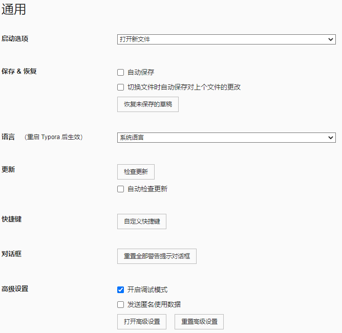

#### 外观

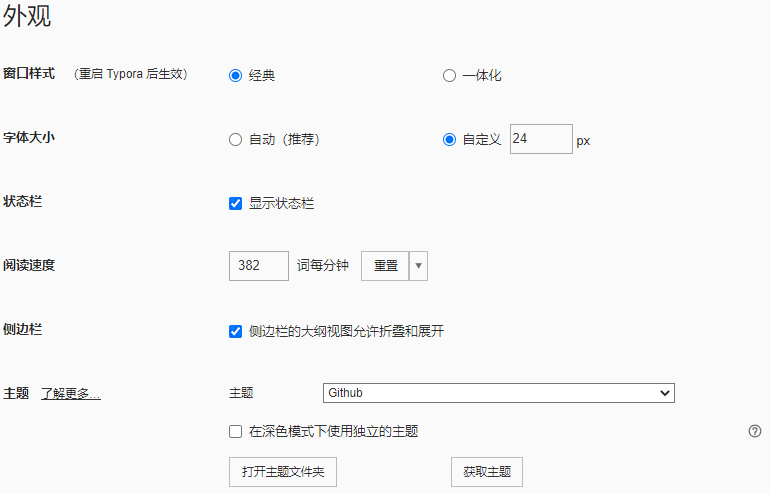

#### 编辑器

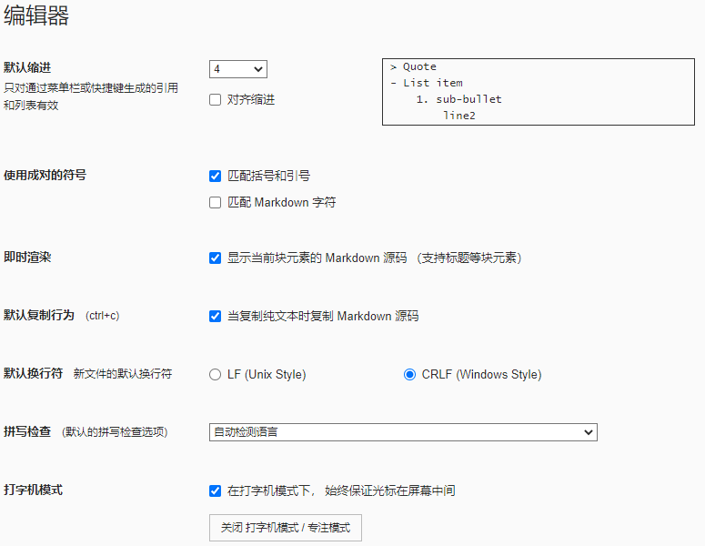

#### 图像

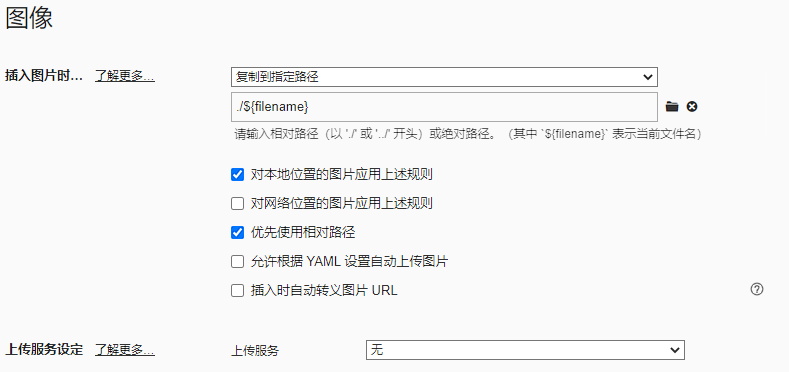

#### Markdown

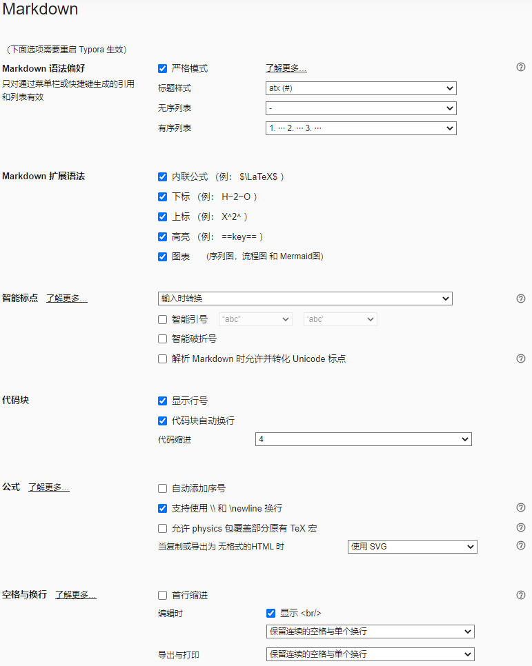

#### 导出

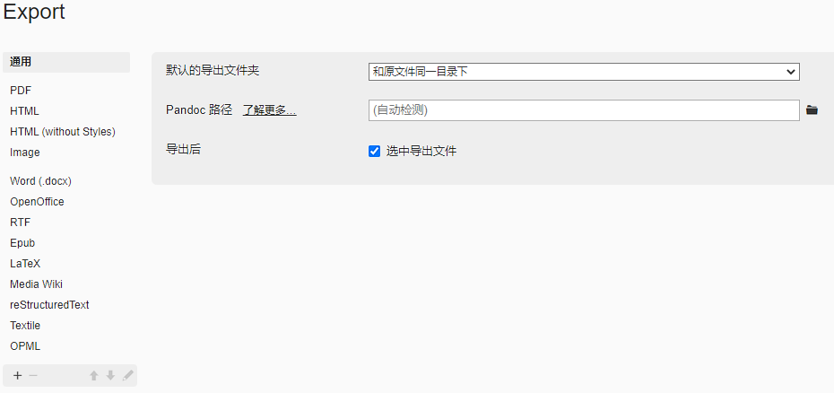


## 编辑

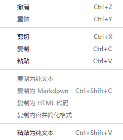

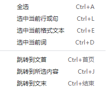


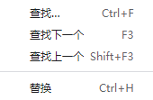


😊	Win+.	表情与符号

## 段落

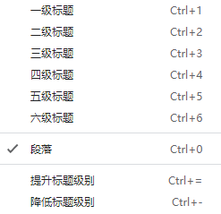

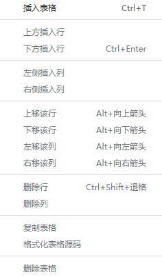

|      |      |      |
| ---- | ---- | ---- |
|      |      |      |
|      |      |      |
|      |      |      |

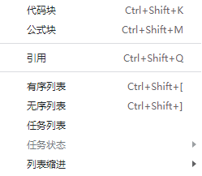

```python
import cv2
```

$$
E=mc^2
$$

> test

1. 
2.  
3. 

- 

- 

-  

-  

    -  


- [ ] test

- [x] test

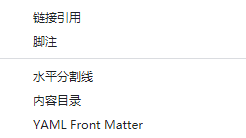

[Markdown]:[Typora|Typora中文|typora下载|typora 主题](https://www.typora.net/)

test[^1]

[^1]:脚注

------


## 格式

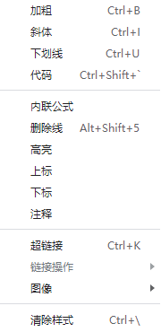

test

**test**	`CTRL+B	加粗`

*test*	`CTRL+I	斜体`

<u>test</u>	`CTRL+U	下划线`

`test`	``CTRL+SHIFT+`	代码``

> test	`CTRL+SHIFT+Q	引用`

~~test~~	`ALT+SHIFT+5	删除线`

[test](https://github.com/likefengzi)	`CTRL+K	超链接`

	`CTRL+SHIFT+I	插入图片`

**test**->test	`CTRL+\	清除样式`

## 视图

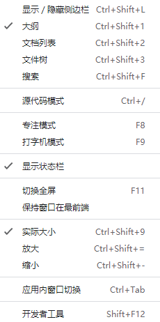


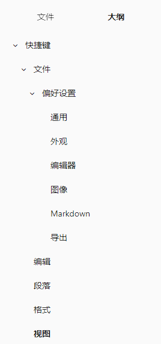

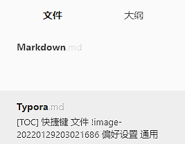

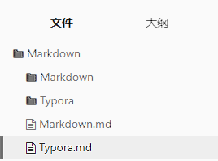

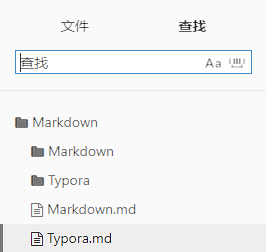

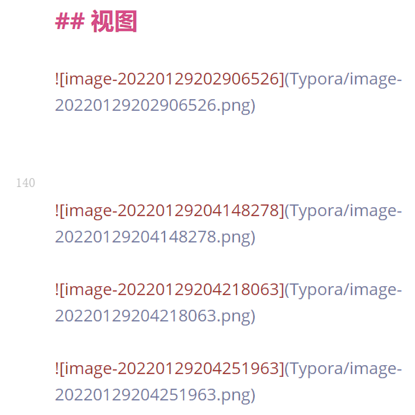

1. 源代码模式

    Typora默认是即时将文件编译的。而源代码模式就是方便直接查看源代码，不再即时编译。

2. 专注模式

    专注模式会将除正在输入行的所有行变灰，保持专注与正在输入的内容。

3. 打字机模式

    保持正在输入行位于窗口中间，避免总是低头。
